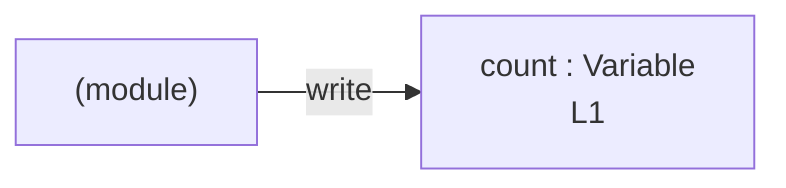

# minimal-let

## Input (`input.ts`)

```ts
let count = 0;
count = 1;
```

## Mermaid


```mermaid
flowchart LR
  n_scope_0_count_4["count : Variable\nL1"]
  module_root -->|write| n_scope_0_count_4
  module_root["(module)"]
```
