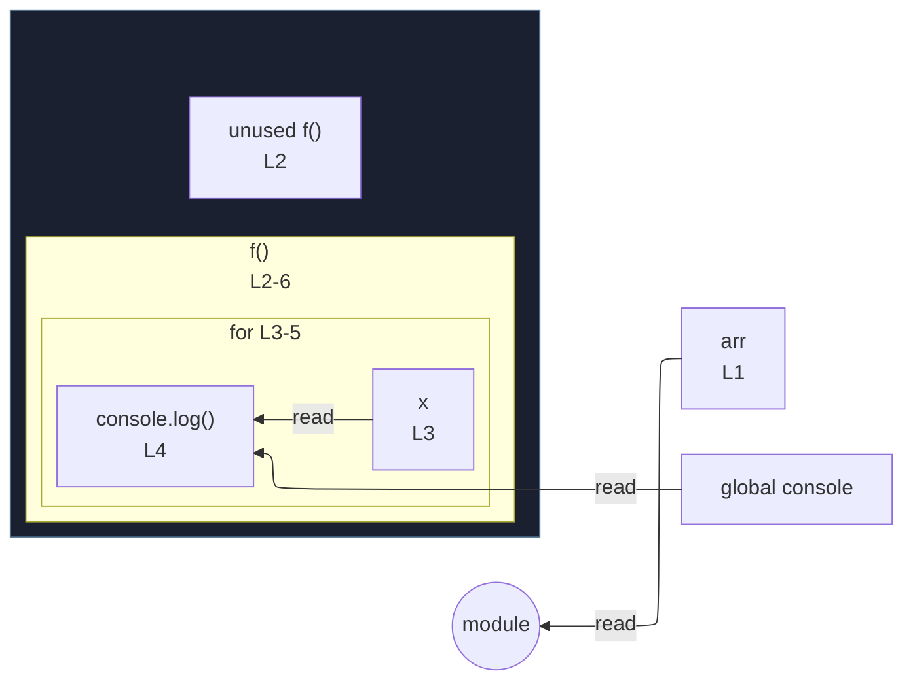

# integration/fixtures/return-subgraph-misclassification/input.ts

## Input

```ts
const arr = [1];
function f() {
  for (const x of arr) {
    console.log(x);
  }
}
```

## Mermaid


```mermaid
%%{init: {"flowchart": {"defaultRenderer": "elk"}}}%%
flowchart RL
  n_scope_0_arr_6["arr<br/>L1"]
  n_scope_0_console_61["global console"]
  subgraph wrap_s_scope_1[" "]
    direction TB
    n_scope_0_f_26["unused f()<br/>L2"]
    subgraph s_scope_1["f()<br/>L2-6"]
      direction RL
      subgraph s_scope_2["for L3-5"]
        direction RL
        n_scope_2_x_45["x<br/>L3"]
        expr_stmt_61["console.log()<br/>L4"]
      end
    end
  end
  n_scope_0_arr_6 -->|read| module_root
  n_scope_0_console_61 -->|read| expr_stmt_61
  n_scope_2_x_45 -->|read| expr_stmt_61
  module_root((module))
  classDef fnWrap fill:#1a2030,stroke:#5a7d99;
  class wrap_s_scope_1 fnWrap;
```
