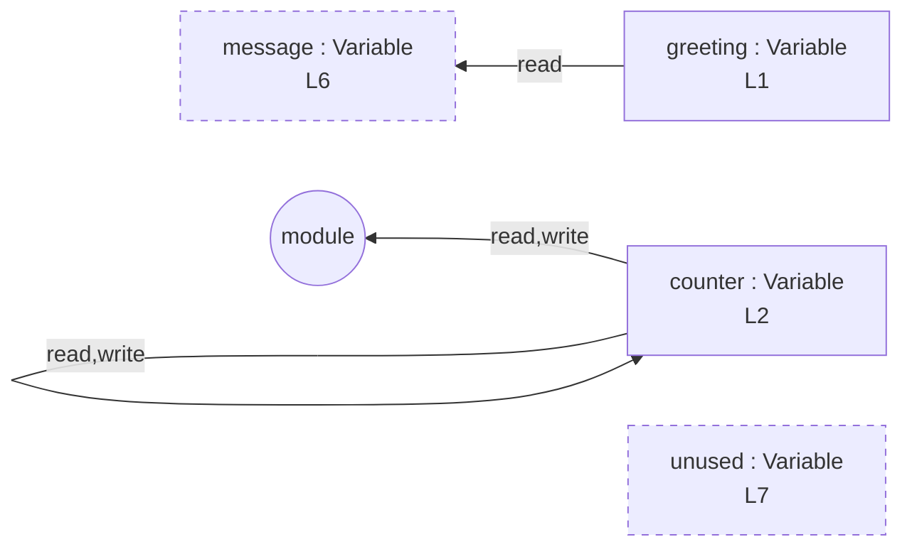

# simple-const-let

## Input (`input.ts`)

```ts
const greeting = "hello";
let counter = 0;
counter = counter + 1;
counter += 2;
counter++;
const message = greeting;
const unused = 99;
```

## Mermaid


