# integration/fixtures/switch-statement/case-with-labeled-abrupt/input.ts

## Input

```ts
function classify(x: number) {
  switch (x) {
    case 1:
      outer: return 1;
    case 2:
      outer: {
        return 2;
      }
    case 3:
      outer: throw new Error("three");
    default:
      return 0;
  }
}

const out = classify(1);
```

## Mermaid

```mermaid
%%{init: {"flowchart": {"defaultRenderer": "elk"}}}%%
flowchart RL
  n_scope_0_out_227["unused out<br/>L16"]
  n_scope_0_Error_169["global Error"]
  subgraph wrap_s_scope_1[" "]
    direction TB
    n_scope_0_classify_9["classify()<br/>L1"]
    subgraph s_scope_1["classify()<br/>L1-14"]
      direction RL
      n_scope_1_x_18["x<br/>L1"]
      subgraph s_scope_2["switch L2-13"]
        direction RL
        switch_discriminant_scope_1_33{"switch ()<br/>L2"}
        subgraph s_scope_3["case 1 L3-4"]
          direction RL
          elk_empty_s_scope_3["No nodes"]
        end
        subgraph s_scope_4["case 2 L5-8"]
          direction RL
          subgraph s_scope_5["block L6-8"]
            direction RL
            elk_empty_s_scope_5["No nodes"]
          end
        end
        subgraph s_scope_6["case 3 L9-10"]
          direction RL
          subgraph s_throw_scope_0_classify_9_159_184["throw L10"]
            direction RL
            throw_use_ref_1["Error<br/>L10"]
          end
        end
        subgraph s_scope_7["default L11-12"]
          direction RL
          elk_empty_s_scope_7["No nodes"]
        end
      end
    end
  end
  n_scope_1_x_18 -->|read| switch_discriminant_scope_1_33
  n_scope_0_Error_169 -->|read,call| throw_use_ref_1
  n_scope_0_classify_9 -->|read,call| n_scope_0_out_227
  classDef nestL1 fill:#11192a,stroke:transparent;
  class wrap_s_scope_1 nestL1;
  classDef nestL2 fill:#1a2538,stroke:transparent;
  class s_scope_1 nestL2;
  classDef nestL3 fill:#243047,stroke:transparent;
  class s_scope_2 nestL3;
  classDef nestL4 fill:#2d3b57,stroke:transparent;
  class s_scope_3 nestL4;
  class s_scope_4 nestL4;
  class s_scope_6 nestL4;
  class s_scope_7 nestL4;
  classDef nestL5 fill:#364666,stroke:transparent;
  class s_scope_5 nestL5;
  class s_throw_scope_0_classify_9_159_184 nestL5;
  classDef elkEmptyPlaceholder fill:transparent,stroke:transparent;
  class elk_empty_s_scope_3 elkEmptyPlaceholder;
  class elk_empty_s_scope_5 elkEmptyPlaceholder;
  class elk_empty_s_scope_7 elkEmptyPlaceholder;
```


