# integration/fixtures/switch-statement/partial-break/input.ts

## Input

```ts
let label = "";
const kind = "a";

switch (kind) {
  case "a":
    label = "alpha";
  case "b":
    label = "beta";
    break;
  default:
    label = "other";
}

const result = label;
```

## Mermaid

```mermaid
%%{init: {"flowchart": {"defaultRenderer": "elk"}}}%%
flowchart RL
  n_scope_0_label_4["let label<br/>L1"]
  n_scope_0_kind_22["kind<br/>L2"]
  n_scope_0_result_168["unused result<br/>L14"]
  subgraph s_scope_1["switch L4-12"]
    direction RL
    switch_discriminant_scope_0_35{"switch ()<br/>L4"}
    subgraph s_scope_2["case &quot;a&quot; L5-6"]
      direction RL
      wr_ref_3(["let label<br/>L6"])
    end
    subgraph s_scope_3["case &quot;b&quot; L7-9"]
      direction RL
      wr_ref_4(["let label<br/>L8"])
      bc_break_120["break<br/>L9"]
    end
    subgraph s_scope_4["default L10-11"]
      direction RL
      wr_ref_5(["let label<br/>L11"])
    end
  end
  n_scope_0_label_4 -->|set| wr_ref_3
  wr_ref_3 -->|fallthrough| wr_ref_4
  n_scope_0_label_4 -->|set| wr_ref_5
  n_scope_0_kind_22 -->|read| switch_discriminant_scope_0_35
  wr_ref_4 -->|read| n_scope_0_result_168
  wr_ref_5 -->|read| n_scope_0_result_168
  classDef nestL1 fill:#11192a,stroke:transparent;
  class s_scope_1 nestL1;
  classDef nestL2 fill:#1a2538,stroke:transparent;
  class s_scope_2 nestL2;
  class s_scope_3 nestL2;
  class s_scope_4 nestL2;
```


