# integration/fixtures/switch-statement/return/input.ts

## Input

```ts
function classify(kind: string) {
  let label = "";

  switch (kind) {
    case "a":
      label = "alpha";
      return label;
    case "b":
      label = "beta";
      break;
    default:
      label = "other";
  }

  return label;
}

const result = classify("a");
```

## Mermaid

```mermaid
%%{init: {"flowchart": {"defaultRenderer": "elk"}}}%%
flowchart RL
  n_scope_0_result_243["unused result<br/>L18"]
  subgraph wrap_s_scope_1[" "]
    direction TB
    n_scope_0_classify_9["classify()<br/>L1"]
    subgraph s_scope_1["classify()<br/>L1-16"]
      direction RL
      n_scope_1_kind_18["kind<br/>L1"]
      n_scope_1_label_40["let label<br/>L2"]
      subgraph s_scope_2["switch L4-13"]
        direction RL
        switch_discriminant_scope_1_55{"switch ()<br/>L4"}
        subgraph s_scope_3["case &quot;a&quot; L5-7"]
          direction RL
          wr_ref_2(["let label<br/>L6"])
          subgraph s_return_scope_0_classify_9_114_127["return L7"]
            direction RL
            ret_use_ref_3["label<br/>L7"]
          end
        end
        subgraph s_scope_4["case &quot;b&quot; L8-10"]
          direction RL
          wr_ref_4(["let label<br/>L9"])
          bc_break_170["break<br/>L10"]
        end
        subgraph s_scope_5["default L11-12"]
          direction RL
          wr_ref_5(["let label<br/>L12"])
        end
      end
      subgraph s_return_scope_0_classify_9_220_233["return L15"]
        direction RL
        ret_use_ref_6["label<br/>L15"]
      end
    end
  end
  n_scope_1_label_40 -->|set| wr_ref_2
  n_scope_1_label_40 -->|set| wr_ref_4
  n_scope_1_label_40 -->|set| wr_ref_5
  n_scope_1_kind_18 -->|read| switch_discriminant_scope_1_55
  wr_ref_2 -->|read| ret_use_ref_3
  wr_ref_4 -->|read| ret_use_ref_6
  wr_ref_5 -->|read| ret_use_ref_6
  n_scope_0_classify_9 -->|read,call| n_scope_0_result_243
  classDef nestL1 fill:#11192a,stroke:transparent;
  class wrap_s_scope_1 nestL1;
  classDef nestL2 fill:#1a2538,stroke:transparent;
  class s_scope_1 nestL2;
  classDef nestL3 fill:#243047,stroke:transparent;
  class s_scope_2 nestL3;
  class s_return_scope_0_classify_9_220_233 nestL3;
  classDef nestL4 fill:#2d3b57,stroke:transparent;
  class s_scope_3 nestL4;
  class s_scope_4 nestL4;
  class s_scope_5 nestL4;
  classDef nestL5 fill:#364666,stroke:transparent;
  class s_return_scope_0_classify_9_114_127 nestL5;
```


