# integration/fixtures/try-statement/catch-reassignment/input.ts

## Input

```ts
function g(): unknown {
  try {
    throw new Error("oops");
  } catch (e) {
    e = "rewritten";
    return e;
  }
}
```

## Mermaid

```mermaid
%%{init: {"flowchart": {"defaultRenderer": "elk"}}}%%
flowchart RL
  n_scope_0_Error_46["global Error"]
  subgraph wrap_s_scope_1[" "]
    direction TB
    n_scope_0_g_9["unused g()<br/>L1"]
    subgraph s_scope_1["g()<br/>L1-8"]
      direction RL
      subgraph s_scope_2["try L2-4"]
        direction RL
      end
      subgraph s_scope_3["catch L4-7"]
        direction RL
        n_scope_3_e_72["catch e<br/>L4"]
        wr_ref_1(["e<br/>L5"])
        subgraph s_return_scope_0_g_9_102_111["return L6"]
          direction RL
          ret_use_ref_2["e<br/>L6"]
        end
      end
    end
  end
  n_scope_3_e_72 -->|set| wr_ref_1
  n_scope_0_Error_46 -->|read,call| module_root
  wr_ref_1 -->|read| ret_use_ref_2
  module_root((module))
  classDef nestL1 fill:#11192a,stroke:transparent;
  class wrap_s_scope_1 nestL1;
  classDef nestL2 fill:#1a2538,stroke:transparent;
  class s_scope_1 nestL2;
  classDef nestL3 fill:#243047,stroke:transparent;
  class s_scope_2 nestL3;
  class s_scope_3 nestL3;
  classDef nestL4 fill:#2d3b57,stroke:transparent;
  class s_return_scope_0_g_9_102_111 nestL4;
```


