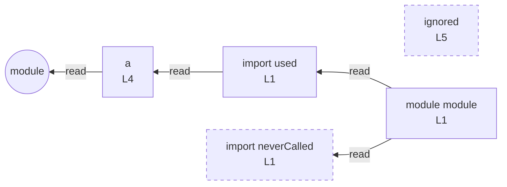

# integration/fixtures/unused-and-var/input.ts

## Input

```ts
import { used, neverCalled } from "module";

var legacy = 1;
const a = used;
const ignored = 99;

console.log(a);
```

## Mermaid


```mermaid
flowchart RL
  n_scope_0_used_9["import used<br/>L1"]
  n_scope_0_neverCalled_15["import neverCalled<br/>L1"]
  n_scope_0_a_67["a<br/>L4"]
  n_scope_0_ignored_83["ignored<br/>L5"]
  n_scope_0_used_9 -->|read| n_scope_0_a_67
  n_scope_0_a_67 -->|read| module_root
  module_root((module))
  mod_module["module module<br/>L1"]
  mod_module -->|read| n_scope_0_used_9
  mod_module -->|read| n_scope_0_neverCalled_15
  classDef unused stroke-dasharray: 5 5;
  class n_scope_0_neverCalled_15 unused;
  class n_scope_0_ignored_83 unused;
```
